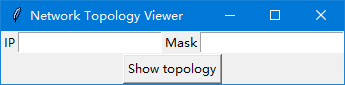
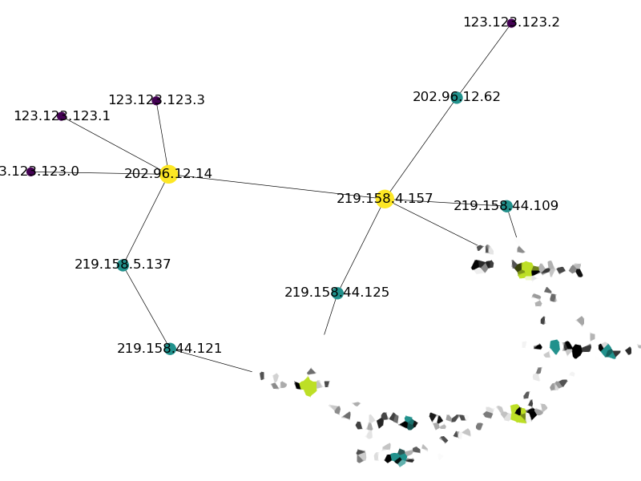

# net-topo
Show topology of a network

## Requirements

In virtualenv, run
```sh
(venv) $ pip install -r requirements.txt
```

## Usage

Run python script `./bin/gui.py` then the very simple form will show up. Under linux, you need root privilege.



Fill the network and click the "Show topology" button, you will get a topology of the network.

Here is an example to show the network `123.123.123.0/30`


